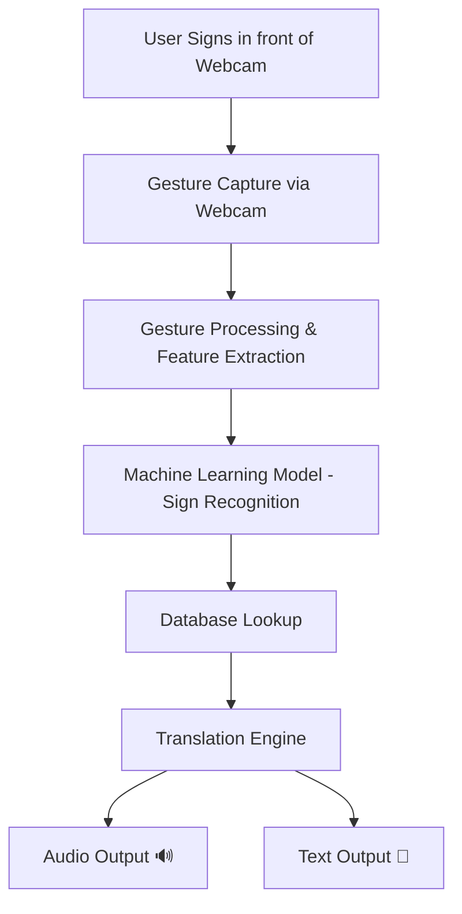
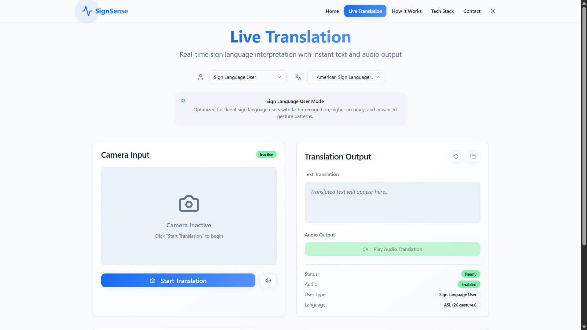
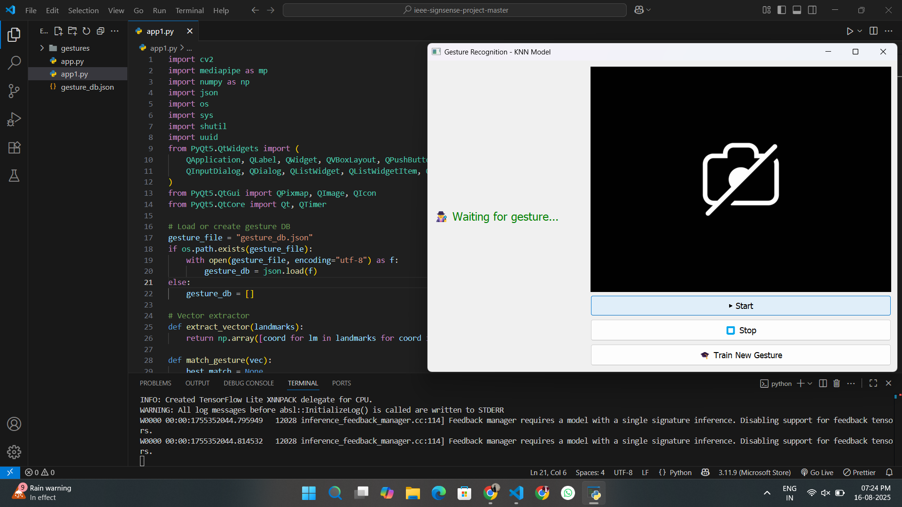

# 🧏‍♂️ SignSense – Webcam-based Sign Language Translator  

         

---

## 🚀 Introduction  
**SignSense** is an AI-powered **webcam-based sign language translation system**.  
It bridges the communication gap between **sign language users** and **non-signers** by providing **real-time gesture recognition** and converting them into **speech & text**.  

This project aims to **break communication barriers**, promote **inclusivity**, and support **better healthcare & accessibility** for the dumb and hard-of-hearing community.  

---

## ✨ Features  

| Feature | Description |
|---------|-------------|
| 🎥 **Webcam-Based Recognition** | Captures sign gestures in real-time using computer vision. |
| 🧠 **AI-Powered Translation** | Uses machine learning models to detect and interpret signs. |
| 🔊 **Speech & Text Output** | Converts detected gestures into spoken audio & text. |
| 🏥 **Healthcare Integration** | Designed for hospitals to improve patient-doctor communication. |
| 🌍 **Future Expansion** | Supports multi-language gestures & platform integrations. |
| 📊 **Data Analytics** | Provides gesture tracking and recognition accuracy metrics. |

---

## 🛠 Tech Stack  

<p align="center">
  <!-- Frontend -->
  
  
  
  
  

  <!-- Backend & AI -->
  
  
  
  

  <!-- Tools -->
  
</p>


---

## 🏗 Block Diagram  



---

## 📸 Screenshots  

<p align="center">
  <!-- Replace these image paths with your actual project screenshots -->
  
  
</p>

---

## 📂 Resources  

<p align="center">
  <!-- Project PPT -->
  <a href="PPTs/SIGN SENSE PPT (1).pptx" target="blank">
    
  </a>

  <!-- Project Video -->
  <a href="Videos/Doctor_Speech.mp4" target="blank">
    
  </a>
</p>

---

## File Tree: SignSense-App-Prototype

```
├── 📁 gestures/
│   ├── 📁 one/
│   │   ├── 🖼️ 196073a5.jpg
│   │   ├── 🖼️ 1eb6be14.jpg
│   │   ├── 🖼️ 25bd5a12.jpg
│   │   ├── 🖼️ 3df8c707.jpg
│   │   ├── 🖼️ 3fc0e085.jpg
│   │   ├── 🖼️ 41213d02.jpg
│   │   ├── 🖼️ 4a6dc938.jpg
│   │   ├── 🖼️ 4df7a39c.jpg
│   │   ├── 🖼️ 586eeaf9.jpg
│   │   ├── 🖼️ 65853e6a.jpg
│   │   ├── 🖼️ 66c03a14.jpg
│   │   ├── 🖼️ 69979d9f.jpg
│   │   ├── 🖼️ 6ee9e0ee.jpg
│   │   ├── 🖼️ 75e9ec3a.jpg
│   │   ├── 🖼️ 8ba1519e.jpg
│   │   ├── 🖼️ 9741be9e.jpg
│   │   ├── 🖼️ 9830875d.jpg
│   │   ├── 🖼️ 986ba059.jpg
│   │   ├── 🖼️ 998c0cbb.jpg
│   │   ├── 🖼️ a1cd7543.jpg
│   │   ├── 🖼️ abdb1cc2.jpg
│   │   ├── 🖼️ bdec0375.jpg
│   │   ├── 🖼️ c7801cdb.jpg
│   │   ├── 🖼️ cf2295bb.jpg
│   │   ├── 🖼️ d2630209.jpg
│   │   ├── 🖼️ e4d85846.jpg
│   │   ├── 🖼️ ea5e0dbf.jpg
│   │   ├── 🖼️ ee6c32ef.jpg
│   │   ├── 🖼️ f217e3e7.jpg
│   │   └── 🖼️ fb4b7706.jpg
│   └── 📁 two/
│       ├── 🖼️ 05a2245f.jpg
│       ├── 🖼️ 0c378a1a.jpg
│       ├── 🖼️ 17a9833b.jpg
│       ├── 🖼️ 1ed0839d.jpg
│       ├── 🖼️ 26c10a90.jpg
│       ├── 🖼️ 278bbefe.jpg
│       ├── 🖼️ 2a339c22.jpg
│       ├── 🖼️ 2adda6e7.jpg
│       ├── 🖼️ 2feb6846.jpg
│       ├── 🖼️ 32de8f05.jpg
│       ├── 🖼️ 39857017.jpg
│       ├── 🖼️ 3ba9e90d.jpg
│       ├── 🖼️ 44d10cc9.jpg
│       ├── 🖼️ 4a2efa13.jpg
│       ├── 🖼️ 509dfe2b.jpg
│       ├── 🖼️ 52a7adeb.jpg
│       ├── 🖼️ 541af653.jpg
│       ├── 🖼️ 56f4af74.jpg
│       ├── 🖼️ 5a836681.jpg
│       ├── 🖼️ 693879de.jpg
│       ├── 🖼️ 6a5b8514.jpg
│       ├── 🖼️ 76ea3a08.jpg
│       ├── 🖼️ 7d65550c.jpg
│       ├── 🖼️ 96105f61.jpg
│       ├── 🖼️ 96d23fe3.jpg
│       ├── 🖼️ 9745ae87.jpg
│       ├── 🖼️ 9a298efd.jpg
│       ├── 🖼️ a9d9e020.jpg
│       ├── 🖼️ ad74a495.jpg
│       └── 🖼️ e89be417.jpg
├── 🐍 app.py
├── 🐍 app1.py
└── 📄 gesture_db.json
```

---

## File Tree: SignSense-Frontend

```
├── 📁 .vite/
│   ├── 📁 deps_temp_0cd38d1b/
│   │   └── 📄 package.json
│   └── 📁 deps_temp_deb1649f/
│       └── 📄 package.json
├── 📁 .vscode/ 🚫 (auto-hidden)
└── 📁 signsense-ai-translator-main/
    ├── 📁 node_modules/ 🚫 (auto-hidden)
    ├── 📁 public/
    │   ├── 🖼️ favicon.ico
    │   ├── 🖼️ placeholder.svg
    │   └── 📄 robots.txt
    ├── 📁 src/
    │   ├── 📁 components/
    │   │   ├── 📁 ui/
    │   │   │   ├── 📄 accordion.tsx
    │   │   │   ├── 📄 alert-dialog.tsx
    │   │   │   ├── 📄 alert.tsx
    │   │   │   ├── 📄 aspect-ratio.tsx
    │   │   │   ├── 📄 avatar.tsx
    │   │   │   ├── 📄 badge.tsx
    │   │   │   ├── 📄 breadcrumb.tsx
    │   │   │   ├── 📄 button.tsx
    │   │   │   ├── 📄 calendar.tsx
    │   │   │   ├── 📄 card.tsx
    │   │   │   ├── 📄 carousel.tsx
    │   │   │   ├── 📄 chart.tsx
    │   │   │   ├── 📄 checkbox.tsx
    │   │   │   ├── 📄 collapsible.tsx
    │   │   │   ├── 📄 command.tsx
    │   │   │   ├── 📄 context-menu.tsx
    │   │   │   ├── 📄 dialog.tsx
    │   │   │   ├── 📄 drawer.tsx
    │   │   │   ├── 📄 dropdown-menu.tsx
    │   │   │   ├── 📄 form.tsx
    │   │   │   ├── 📄 hover-card.tsx
    │   │   │   ├── 📄 input-otp.tsx
    │   │   │   ├── 📄 input.tsx
    │   │   │   ├── 📄 label.tsx
    │   │   │   ├── 📄 menubar.tsx
    │   │   │   ├── 📄 navigation-menu.tsx
    │   │   │   ├── 📄 pagination.tsx
    │   │   │   ├── 📄 popover.tsx
    │   │   │   ├── 📄 progress.tsx
    │   │   │   ├── 📄 radio-group.tsx
    │   │   │   ├── 📄 resizable.tsx
    │   │   │   ├── 📄 scroll-area.tsx
    │   │   │   ├── 📄 select.tsx
    │   │   │   ├── 📄 separator.tsx
    │   │   │   ├── 📄 sheet.tsx
    │   │   │   ├── 📄 sidebar.tsx
    │   │   │   ├── 📄 skeleton.tsx
    │   │   │   ├── 📄 slider.tsx
    │   │   │   ├── 📄 sonner.tsx
    │   │   │   ├── 📄 switch.tsx
    │   │   │   ├── 📄 table.tsx
    │   │   │   ├── 📄 tabs.tsx
    │   │   │   ├── 📄 textarea.tsx
    │   │   │   ├── 📄 toast.tsx
    │   │   │   ├── 📄 toaster.tsx
    │   │   │   ├── 📄 toggle-group.tsx
    │   │   │   ├── 📄 toggle.tsx
    │   │   │   ├── 📄 tooltip.tsx
    │   │   │   └── 📄 use-toast.ts
    │   │   ├── 📄 Footer.tsx
    │   │   └── 📄 Navigation.tsx
    │   ├── 📁 hooks/
    │   │   ├── 📄 use-mobile.tsx
    │   │   └── 📄 use-toast.ts
    │   ├── 📁 lib/
    │   │   └── 📄 utils.ts
    │   ├── 📁 pages/
    │   │   ├── 📄 Contact.tsx
    │   │   ├── 📄 GoalAndImpact.tsx
    │   │   ├── 📄 HowItWorks.tsx
    │   │   ├── 📄 Index.tsx
    │   │   ├── 📄 LiveTranslation.tsx
    │   │   ├── 📄 NotFound.tsx
    │   │   ├── 📄 StreamlitApp.tsx
    │   │   ├── 📄 TeachableMachine.tsx
    │   │   └── 📄 TechStack.tsx
    │   ├── 🎨 App.css
    │   ├── 📄 App.tsx
    │   ├── 🎨 index.css
    │   ├── 📄 main.tsx
    │   └── 📄 vite-env.d.ts
    ├── 🚫 .gitignore
    ├── 📖 README.md
    ├── 📄 bun.lockb
    ├── 📄 components.json
    ├── 📄 eslint.config.js
    ├── 🌐 index.html
    ├── 📄 package-lock.json
    ├── 📄 package.json
    ├── 📄 postcss.config.js
    ├── 📄 tailwind.config.ts
    ├── 📄 tsconfig.app.json
    ├── 📄 tsconfig.json
    ├── 📄 tsconfig.node.json
    └── 📄 vite.config.ts
```

---
**Built with ❤️ by M. Dinesh**

*Last Updated: August 2025*
